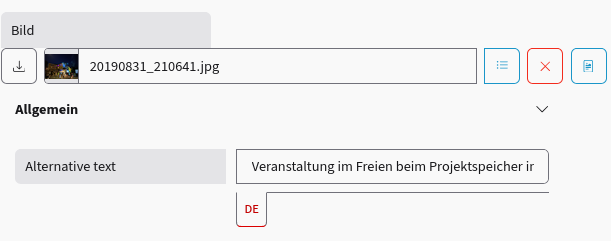
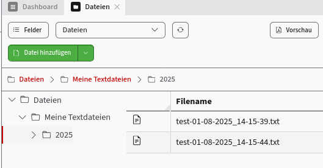
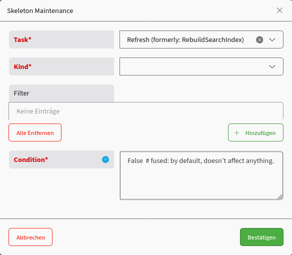

# Was ist neu in viur-core 3.8?

Dieses Dokument beschreibt die größten Änderungen im Bezug auf viur-core 3.8.

## Allgemeines

viur-core 3.8 ist nur noch mit Python 3.12 und Python 3.13 kompatibel. Alle Versionen darunter werden nicht mehr unterstützt. Die Dokumentation wird jetzt ebenfalls mit dem aktuellstem Sphinx unter Python 3.13 erzeugt.

In viur-core 3.8 sind die Kompatiblitätsflags für alte Admin und Vi-Versionen standardmäßig deaktiviert, so dass ausschließlich die neuen Formate verwendet werden.

Die folgenden Zeilen können in Projekten die auf viur-core 3.8 portiert werden nun komplett entfernt werden:

```py
# Diese Zeilen können weg:
conf.compatibility.remove("json.bone.structure.keytuples")
conf.compatibility.remove("json.bone.structure.camelcasenames")
conf.compatibility.remove("bone.select.structure.values.keytuple")
conf.compatibility.remove("json.bone.structure.inlists")
```

Außerdem läuft die `conf` jetzt im strict-mode, d.h. die Kompatiblität zu alten `conf`-Zugriffen wie z.B. `conf["mainApp"]` ist nicht mehr erlaubt.

In den Renderern wurden die Module `render.json.user` und `render.vi.user` komplett und ersatzlos entfernt. Referenzen auf diese sollten in alten Projekten entfernt werden. Es wird jetzt nur noch die jeweilige default-Klasse für alle Renderer benutzt.

## Internationalisierung (i18n)

Sämtliche Bone validierungen liefern jetzt übersetzte Fehlermeldungen (war vorher hart auf English).

Über das Flag `conf.i18n.auto_translate_bones` kann nun global eingestellt werden, ob `descr` und `params.category` bei Bones automatisch übersetzt werden sollen oder nicht (default: True, wie vorher).

## Datenbank

## `db`-Modul ist wieder in viur-core

Das `db`-Modul, die ViUR-Abstraktion für die low-level Cloud Datastore Datenbankzuriffe, ist jetzt wieder Bestandteil von `viur-core` selbst.

Das Modul wurde in viur-core 3.1 in ein eigenes Paket `viur-datastore` ausgegliedert. Dies geschah zum einen wegen einer damals besseren Performance, zum anderen auch um andere Datenbanken anzubinden - was aber nie passierte. Schlussendlich führte diese Splittung zu größeren Problemen und Inkonsistenzen in der Weiterentwicklung, und die Google-eigene Implementation der Datastore-API ist inzwischen auch wieder schneller.

Die re-integrierte `db`-API enthält die bekannten Funktionen wie `db.put`, `db.get`, `db.delete` usw. Diese werden jetzt aber PEP-8 konform in Snake-Case geschrieben, so dass die Benutzung der alten Funktionen eine Deprecation-Warning erzeugt.

Die Konfiguration von `db`-spezifischen Einstellungen erfolgt über [`conf.db`](https://core.docs.viur.dev/en/develop/viur/core/config/index.html#core.config.Database).

### Query-Limits

> [!IMPORTANT]
> Ab viur-core 3.8 muss nicht mehr bei externen Aufrufen von Listen-Modulen das explizite `/example/list?limit=99` übergeben werden um mehr als 30 Datensätze zu erhalten. Das geht jetzt besser, bitte nutzt die neuen Möglichkeiten!

Hier wurde von ViUR immer erwartet das weitere Datensätze per Cursor nachgeladen werden, was bei Jinja-Templates nur mit JavaScript und ziemlich bekloppt lösbar wäre. Diese Limits (30 und 100) waren bisher hard-codiert. 

Dies kann jetzt über folgende `conf`-Variablen global und individuell im Projekt modifiziert werden:

- `conf.db.query_default_limit` (default: 30) ist das Standard-Limit für Queries.
- `conf.db.query_external_limit` (default: 100) ist das Limit für Queries, welches über externe Aufrue maximal gesetzt werden darf. Dies verhindert, dass man als Benutzer eines ViUR-Systems von außen ein Limit von 30000 setzen kann, obwohl nur `conf.db.query_default_limit = 100` gesetzt wurde.

Ein Projekt, das in der main.py z.B. mit

```py
conf.db.query_default_limit = 200
```

konfiguriert wird, holt bei allen Abfragen also immer bis zu 200 Einträge, also kann man sich das `?limit=99` sparen, wenn man z.B. 120 Datensätze erwartet, und "die maximal mögliche Anzahl" haben möchte, weil das interne Limit schon auf 200 gesetzt wurde.

### Skeleton-API

Die Skeleton-API (ehem. `skeleton.py`) wurde jetzt in ein Modul mit mehreren Dateien aufgesplittet.

#### `viur-relations` und `RelationalConsistency`

Ferner wurde das gesamte `viur-relations`-Handling um die Funktion `update_relations()` komplett refactored. So werden auch RelationalBones in RecordBones mit aktualisiert. Auch RelationalConsistency-Konsistenzprüfungen werden jetzt über `update_relations()` behandelt - dies wurde vorher durch die Funktion `processRemovedRelations` gelöst, die durch das Refactoring ersetzt und obsolet wurde.

#### RelationalBone.fromClient() refactored

`RelationalBone.fromClient()` wurde auch dahingehend refactored, dass RelationalConsistency-Einstellungen akzeptiert werden und allgemein grottiger Code entfernt. Dies verhindert, dass im Fall einer gesetzten RelationalConsistency das Speichern von Relationen auf nicht mehr vorhandene Datensätze unterbunden wird. Ist keine RelationalConsistency gesetzt, verhält sich das Bone genau wie zuvor.

#### RefSkel.read()

Man kann jetzt direkt das Target-Skeleton eines RelationalBones mittels [RefSkel.read()](https://core.docs.viur.dev/en/develop/viur/core/skeleton/relskel/index.html#core.skeleton.relskel.RefSkel.read) auslesen.

```py
# User lesen
user_skel = UserSkel()
assert user_skel.read(key)

# Firma zum User auslesen
company_skel = user_skel["company"]["dest"].read()  # gesamtes CompanySkel (ging schon in v3.7)

# ... man kann auch (dynamische) SubSkels erzeugen (nur ab v3.8):
company_skel = user_skel["company"]["dest"].read(subskel=("select",))  # in subSkels definiertes SubSkel
company_skel = user_skel["company"]["dest"].read(bones=("name", "city",))  # dynamisches SubSkel
```

#### Skeleton.readonly()

Alle Bones eines Skeletons auf `readOnly=True` setzen, z.B. für ActionSkels:
```py
channel_skel.readonly()
```

#### Skeleton.dump()

Eine JSON-serialisierbare Repräsentation direkt aus einem Skeleton erzeugen:
```py
channel_skel.dump()
```

Früher musste man dafür sowas beklopptes machen:
```py
from viur.core.render.json.default import DefaultRender as JsonRender
#...
JsonRender().renderSkelValues(channel_skel)
```

### Bones

#### `searchable=True` für `RawBone`

RawBones können jetzt `searchable=True` sein. Außerdem wurde die Extrahierung der Suchbegriffe auf reguläre Ausdrücke umgestellt und zwischen String-, Text- und RawBone generalisiert.

#### ImageBone

Das `ImageBone` sollte allgemein für Bilder benutzt werden, und wurde für die Barrierefreiheit sowie allgemein zur klaren Definition eines Bildes in den Daten eingeführt.

Es ist konfiguriert als

```py
class ImageBone(FileBone):
    type = FileBone.type + ".image"

    def __init__(
        self,
        *,
        public: bool = True,
        using: t.Optional[RelSkel] = ImageBoneRelSkel,
        validMimeTypes: None | t.Iterable[str] = ["image/*"],
        **kwargs,
    ):
        super().__init__(
            public=public,
            using=using,
            validMimeTypes=validMimeTypes,
            **kwargs,
        )
```

Das `ImageBoneRelSkel` enthält übersetzte Felder für Alt-Texte.



## `Module.skel()`

Generell gibt es jetzt für Module die Funktion `skel()`. Diese ist äquivalent zu `baseSkel()`, nur kürzer. Sie wird in viur-core>=4 noch eine größere Rolle spielen.

```py
assert (skel := self.skel().read(key))  # alles da! :-D
```

## `File`-Modul

Die Funktion [`File.write()`](https://core.docs.viur.dev/en/develop/viur/core/modules/file/index.html#core.modules.file.File.write) erlaubt nun die optionale Angabe eines Repository und eines Pfades. Dadurch können Dateien, die vom ViUR System geschrieben werden, direkt auch in ein Verzeichnis im File-Modul geschrieben werden. Das Verzeichnis wird automatisch angelegt, wenn es nicht existiert.

```py
conf.main_app.file.write(
    f"test-{utils.utcNow().strftime("%d-%m-%Y_%H-%M-%S")}.txt",
    b"Hello World",
    folder=("Meine Textdateien", str(utils.utcNow().year))
)
```



## `History`-Modul

Es gibt jetzt erstmals ein ViUR-Standard-History-Modul. Dieses besteht aus den Komponenten [`History` (ein List-Modul)](https://core.docs.viur.dev/en/develop/viur/core/modules/history/index.html#core.modules.history.History) und dem `HistoryAdapter`.

Das History-Modul schreibt per Default in das ViUR System, kann aber auch optional nach BigQuery schreiben. Dies wird über die [History-Config](https://core.docs.viur.dev/en/develop/viur/core/config/index.html#core.config.History) konfiguriert.

Um das Modul zu verwenden muss es einmal im System (so wie `File`) gesubclassed werden:

```py
from viur.core.modules.history import History

class History(History):
    adminInfo = History.adminInfo | {
        "moduleGroup": "system",  # hier wird z.B. das Modul in eine andere Module-Gruppe gelegt
    }
```

Ein Skeleton, welches History-Einträge erzeugen soll, muss so konfiguriert werden:

```py
from viur.core.skeleton import Skeleton, ViurTagsSearchAdapter
from viur.core.bones import *
from viur.core.modules.history import HistoryAdapter


class ExampleSkel(Skeleton):
    database_adapters = (
        ViurTagsSearchAdapter(),
        HistoryAdapter(),
    )
```

Über den [HistoryAdapter](https://core.docs.viur.dev/en/develop/viur/core/modules/history/index.html#core.modules.history.HistoryAdapter) können weitere Einstellungen erfolgen, z.B. welche Bones ingoriert werden sollen.

## `User`-Modul

### `is_admin()`-Funktion

Die `is_admin()`-Funktion des User-Moduls definiert, welche User als Administrator gelten. Dies kann projektspezifisch definiert werden. Bisherige Prüfungen der Art `if "root" in user["access"]:` sollten durch `if conf.main_app.user.is_admin(user):` ersetzt werden.

Prüfung auf `"root" in user["access"]` sollten wirklich nur für Fälle benutzt werden, wo wirklich Super-User-Rechte notwendig sind (z.B. Maintenance-Funktionen).

### Login-Prozess auf ActionSkels umgestellt

Der Login-Prozess im User-Modul wurde dahingehend verändert, dass jetzt ActionSkels ausgegeben werden, um den User mit einer bestimmten Login-Methode durch den Login-Prozess zu führen. Dies wird im Admin umgesetzt und demnächst für mehrere Projekte relevant sein.

> [!IMPORTANT]
> Dies ist ein kleiner Breaking-Change, der aber nur in speziellen Projekten zu einem Problem führen könnte, da die Funktion /vi/user/login jetzt entweder ein ActionSkel anzeigt, mit den möglichen Login-Methoden (wenn es mehrere gibt), oder auf die einzige existieren Login-Methode weiterleitet. Die Funktion mit dem krankhaft wunderbescheuerten Namen /vi/user/getAuthMethods, die vorher genau das gleiche ausgab wie /vi/user/login, ist damit deprecated und fliegt bald raus.

### `User.adminInfo` ist jetzt eine Funktion

Man kann nicht mehr - wie bisher - sowas machen:

```py
from viur.core.modules.user import User

class User(User):
    adminInfo = User.adminInfo | {
        # ...weitere Settings...
    }
```
sondern man muss jetzt explizit
```py
from viur.core.modules.user import User

class User(User):
    def adminInfo(self):
        return super().adminInfo() | {
        # ...weitere Settings...
    }
```
machen.

> [!IMPORTANT]
> Dies ist ein kleiner Breaking-Change, der in einigen Projekten dazu führen könnte das ein Fehler beim Projektstart auftritt. Bitte entsprechend wie oben korrigieren.

## SkeletonMaintenanceTask

Der Server-Task `rebuildSearchIndex` wurde entfernt, und durch `SkeletonMaintenanceTask` ersetzt.

Mit diesem Task können ausschließlich 'root'-Benutzer ein oder mehrere Kinds

- Refreshen (ehemals rebuildSearchIndex)
- Löschen
- Zählen

Es kann eine Filterung vorgenommen werden, die die Datenselektion vorfiltert (normales Filtering).

Außerdem kann mit Hilfe von Logics ein programmierter Bedingungsausdruck definiert werden, der für jeden Datensatz angewendet wird und diesen refreshed, löscht oder zählt.



> [!IMPORTANT]
> Die Condition `False  # fused: by default, doesn't affect anything.` die immer voreingestellt ist, ist wie eine Sicherheitsabfrage.
> Wird diese so gelassen, dann wird KEIN Datensatz refreshed, gelöscht oder gezählt. Daher muss man explizt `True` oder etwas reglementierendes dort hineinschreiben.
