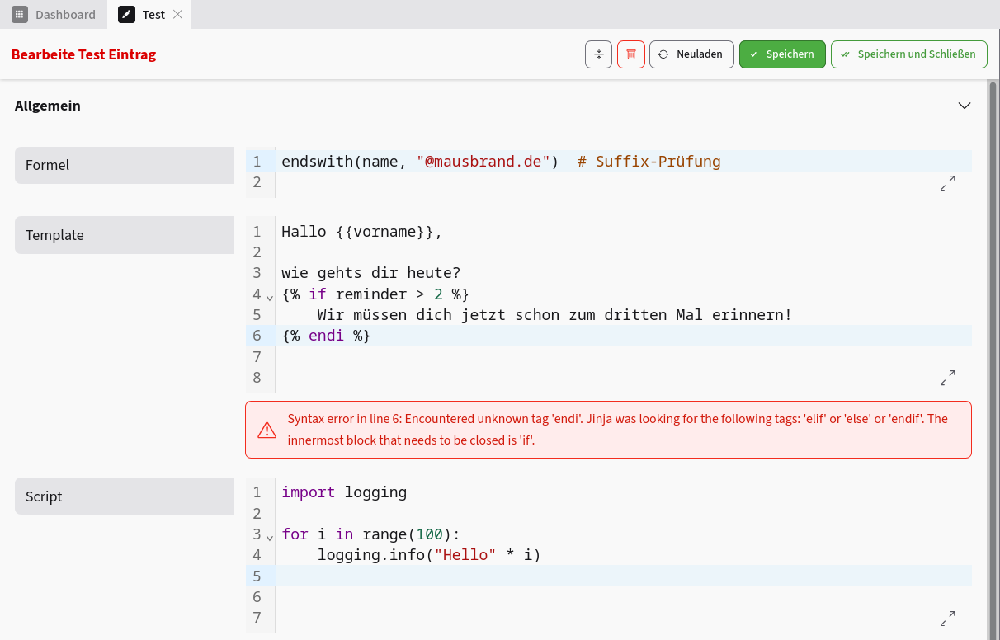
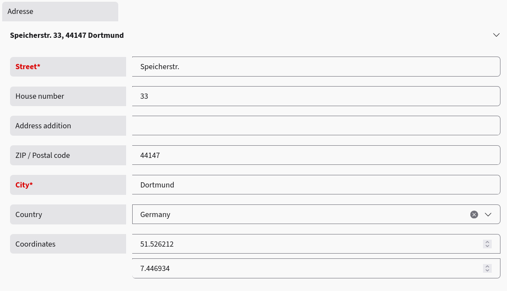
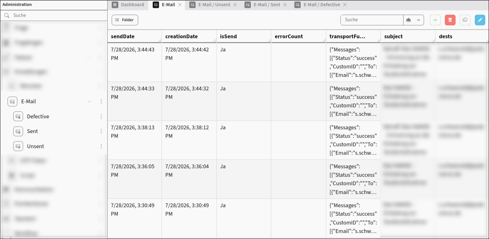
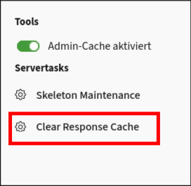

# Was ist neu in viur-core 3.9?

Dieses Dokument beschreibt die größten Änderungen im Bezug auf viur-core 3.9.

## Datenbank

### Memcache für den Datastore

`db.get`, `db.put` und `db.delete` liegen jetzt auf einem Cache-Layer, der über Memcache angebunden ist. Bei `db.get()` wird zuerst versucht, die angefragten Keys aus dem Cache zu lesen, und nur die dort fehlenden Keys werden tatsächlich per `get_multi` aus dem Datastore geholt und anschließend in den Cache zurückgeschrieben. `db.put()` und `db.delete()` spiegeln jeden Schreibzugriff entsprechend in den Cache.

Innerhalb einer laufenden Transaktion wird der Cache komplett umgangen (weder gelesen noch geschrieben), da ein Datensatz, der gerade in einer Transaktion geschrieben wird, nicht zwischengespeichert werden darf.

Der Effekt: mehrfache `db.get()`-Aufrufe für dieselben Keys innerhalb eines Requests oder Prozesses erzeugen keinen erneuten Datastore-Roundtrip mehr.

Um den Memcache für ViUR zu aktivieren müssen folgende Zeilen der `main.py` hinzugefügt werden:

```py
from viur.core import conf
from google.appengine.api.memcache import Client as MemcacheClient

conf.db.memcache_client = MemcacheClient()
```

### Konfigurierbare Datenbank und Namespaces

Google Cloud Datastore unterstützt inzwischen mehrere benannte Datenbanken pro Projekt sowie Namespaces. Dies kann jetzt über

- `conf.db.name` (oder Umgebungsvariable `VIUR_DB_NAME`)
- `conf.db.namespace` (oder Umgebungsvariable `VIUR_DB_NAMESPACE`)

konfiguriert werden.

> [!IMPORTANT]
> Da der Datastore-Client bereits beim Import von `db.transport` aufgebaut wird, müssen die Umgebungsvariablen gesetzt sein, bevor `viur.core` importiert wird. Ein nachträgliches Setzen von `conf.db.name` zur Laufzeit wirkt sich nicht mehr auf den bereits erstellten Client aus.

Ist nichts konfiguriert, verhält sich alles wie bisher (Standard-Datenbank, kein Namespace) - die Änderung ist vollständig abwärtskompatibel.

### Native Datastore-Operatoren statt client-seitiger MultiQuery

Filter wie `IN`, `!=` und `NOT_IN` wurden bisher clientseitig in mehrere Teil-Queries aufgesplittet und danach im Code wieder zusammengeführt (`MultiQuery`). Das kostete unnötig viele RPCs und sorgte dafür, dass `default_order` bei solchen Queries nicht mehr griff.

Diese Filter werden jetzt direkt als native Datastore-Operatoren an Cloud Datastore übergeben - aus vielen Teil-Requests wird einer.

Zusätzlich gibt es jetzt `Query.or_filter()`, um ODER-verknüpfte Bedingungsgruppen nativ abzubilden:

```py
q = skel.all()
q.or_filter(("continent =", "Africa"), ("continent =", "Asia"))
q.or_filter(("sortindex >", 200), ("sortindex <", 50))  # wird mit der Gruppe oben UND-verknüpft
```

Mehrere `or_filter()`-Aufrufe werden untereinander sowie mit normalen `filter()`-Aufrufen UND-verknüpft.

### `keys_only`-Tooling für `Query`

Wenn nur die Keys eines Suchergebnisses interessieren (z.B. für Bulk-Löschungen oder reine Existenzprüfungen), müssen jetzt keine kompletten Entities mehr geladen werden:

```py
keys = skel.all().filter("is_active =", False).keys_only()

# oder über run()/iter():
keys = skel.all().run(keys_only=True)
```

Das spart Lesekosten und Datenvolumen, lässt sich aber nicht mit Volltextsuche kombinieren.

### `QueryOrder`

Sortierungen einer Query können jetzt typisiert als `db.QueryOrder(name, order=SortOrder.Ascending)` oder `db.QueryOrder(name, order=SortOrder.Descending)` angegeben werden, statt als loses Tupel `(name, SortOrder)`. Alte Aufrufe mit Tupeln funktionieren unverändert weiter, da intern normalisiert wird.

### `Query.iter_skel()`

Analog zu `fetch()` bei `run()` gibt es jetzt `iter_skel()` als Pendant zu `iter()`: Es streamt große Ergebnismengen über einen Cursor, liefert dabei aber direkt `SkeletonInstance`-Objekte statt roher `Entity`-Objekte.

```py
for skel in someSkel.all().filter("is_active =", True).iter_skel():
    skel.patch({"touched": True})
```

`iter_skel()` funktioniert nur bei Queries, die über `skel.all()` erzeugt wurden, und nicht bei Multi-Queries.

## Skeletons

### `preprocess`-Funktion für `Skeleton.patch()`

`Skeleton.patch()` akzeptiert jetzt ein optionales `preprocess`-Callable, das innerhalb derselben Transaktion unmittelbar vor `skel.write()` ausgeführt wird - also nachdem `values`, `create` und `check` bereits angewendet wurden, aber noch bevor gespeichert wird:

```py
def preprocess(skel):
    skel["touched"] = utils.utcNow()

skel.patch(values={"name": "Neuer Name"}, preprocess=preprocess)
```

Damit lassen sich Edit-Flows transaktionssicher erweitern, ohne die komplette Patch/Transaktions-Logik selbst nachzubauen.

### Fix: Compute-Bones bei kaskadierendem Löschen

Wenn ein Skeleton im Rahmen einer kaskadierenden Löschung entfernt wird, wurden Compute-Bones (z.B. relationale Lookups) bisher trotzdem noch berechnet - was zu Fehlern führen konnte, weil die referenzierten Datensätze bereits am Verschwinden waren. Das ist jetzt unterbunden.

### Fix: `Skeleton.write()` sollte entfernte Bones nicht wiederherstellen

Wurde eine Bone zur Laufzeit von einem Skeleton entfernt (z.B. `skel.some_bone = None`, etwa bei dynamisch gebauten SubSkels), schrieb `Skeleton.write()` bislang trotzdem wieder den zuletzt bekannten Wert dieser Bone in die Datenbank zurück. Entfernte Bones werden jetzt beim Schreiben komplett übersprungen; ihre referenzierten Blobs werden dabei weiterhin korrekt gegen die Blob-Garbage-Collection gesperrt.

## Bones

### `tags`-Feature für Bones

Jede Bone kann jetzt mit einem `tags`-Parameter versehen werden, um sie inhaltlich zu klassifizieren, z.B. für Datenschutz-, Audit- oder Anonymisierungs-Tooling:

```py
email = EmailBone(tags=("personal", "contact"))
```

Übliche Werte sind u.a. `"personal"`, `"contact"`, `"identifier"`, `"location"`, `"financial"`, `"technical"`. Die Tags werden über `bone.structure()` mit ausgegeben.

> [!IMPORTANT]
> `tags` ist reine Metadaten-Klassifizierung und hat keinerlei Einfluss auf Zugriffsrechte.

Im ViUR selbst sind bereits einige Bones vorbelegt, etwa `KeyBone` mit `tags="technical"` oder `UserSkel.name` mit `("personal", "identifier", "contact")`.


### Neue Bones: `CodeBone`, `LogicsBone`, `JinjaBone` und `PythonBone`

Für Code, welcher in der Datenbank gespeichert und im Backend ausgewertet werden soll, gibt es jetzt eine eigene Bone-Familie mit Syntaxvalidierung:

```py
class MySkel(Skeleton):
    formula = LogicsBone(descr="Formel")   # validiert per Logics-Expression-Language
    template = JinjaBone(descr="Template") # validiert per Jinja2-Parser
    script = PythonBone(descr="Script", validate=False)  # AST-Validierung, hier deaktiviert
```

`CodeBone` selbst ist die generische Basis (kein `multiple`, keine `languages`) mit den Parametern `validate: bool = True` und `syntax: str | None` für das Frontend-Highlighting.



### `NumericBone` mit Decimal-Unterstützung

`NumericBone` kann jetzt über `decimal=True` intern mit `decimal.Decimal` statt mit Float rechnen:

```py
price = NumericBone(precision=2, decimal=True)
```

Damit werden Werte exakt und ohne Rundungsfehler gespeichert. Intern ändert sich dabei die Serialisierungsform auf `{"val": 19.99, "decimal": "19.99"}`: Filterung und Sortierung laufen weiterhin über den (ungenaueren, aber indexierbaren) Float-Wert in `val`, während die exakte Dezimalzahl in `decimal` als String erhalten bleibt. Der JSON-Renderer unterstützt das neue Format entsprechend.

### `AddressBone`

Ein neues, vorgefertigtes Bone für Adressen inklusive automatischer Geokodierung:

```py
address = AddressBone(descr="Adresse")
```

Das zugrundeliegende `AddressRelSkel` enthält Straße, Hausnummer, Adresszusatz, PLZ (validiert gegen länderspezifische Regex-Muster), Ort, Land und Koordinaten. Beim Speichern wird die eingegebene Adresse automatisch per Nominatim/OpenStreetMap geokodiert; die ermittelten Koordinaten werden in einem eigenen Datastore-Kind zwischengespeichert, um die (rate-limitete) kostenlose API nicht unnötig oft anzufragen.



#### `after_from_client`-Hook

Die Geokodierung von `AddressBone` basiert auf einem neuen, generell nutzbaren Hook: `after_from_client(skel, name, errors)` wird am Ende von `fromClient()` aufgerufen, nachdem der Wert bereits validiert und in den Skeleton geschrieben wurde. Eigene Bones können darüber den gesetzten Wert nachträglich normalisieren oder zusätzliche Fehler eintragen.

### `escape_html` für `TextBone` und global konfigurierbar

`TextBone` besitzt jetzt - analog zu `StringBone` - einen `escape_html`-Parameter:

```py
text = TextBone(escape_html=False)  # nur zusammen mit validHtml=None erlaubt
```

> [!IMPORTANT]
> Wird `escape_html=False` gesetzt, entfällt der XSS-Schutz komplett, und referenzierte Dateien innerhalb des Textes werden nicht mehr vor dem Löschen geschützt (`getReferencedBlobs()` liefert dann immer eine leere Menge).

Für `StringBone` lässt sich der Default jetzt zusätzlich global über `conf.bone_string_escape_html` (Standard: `True`) steuern, statt ihn an jeder einzelnen Bone wiederholen zu müssen.

### `CaptchaBone`: Migration zu reCAPTCHA Enterprise

`CaptchaBone` nutzt jetzt intern die reCAPTCHA-Enterprise-SDK statt des alten öffentlichen REST-Endpunkts. Die Parameter `publicKey`/`privateKey` heißen jetzt `public_key` (alter Name funktioniert weiterhin, erzeugt aber eine Deprecation-Warnung); `privateKey` entfällt vollständig, da die Authentifizierung über die GCP-Service-Account-Credentials läuft. Neu hinzugekommen sind `render_challenge` (sichtbare Checkbox statt unsichtbarem v3-Scoring) und `recaptcha_action` für Analytics/Scoring. `conf.security.captcha_default_credentials` wurde zu `conf.security.captcha_default_public_key`.

### `RelationalBone`: Performance und Bugfixes

`RelationalBone.postSavedHandler` schrieb bisher pro Relation einen eigenen `db.put()` und pro entfernter Relation ein eigenes `db.delete()` - bei jedem Speichern eines Skeletons mit relationalen Bones. Diese Schreibzugriffe werden jetzt gesammelt und pro Speichervorgang in jeweils einem einzigen Commit geschrieben. Das bringt neben weniger Roundtrips auch echte Atomarität (vorher konnte ein Teil der Relationen geschrieben werden und ein anderer nicht) und schont das "eine Schreibung pro Sekunde und Entity-Group"-Limit des Datastore, da alle `viur-relations`-Einträge eines Datensatzes dieselbe Entity-Group teilen.

Gemessene Schreibdauer für N Entities, ein `put()` je Entity im Vergleich zu einem gebündelten `put()` (Median aus 3 Messungen, realer Datastore):

| Entities | einzeln | gebündelt | Faktor |
|---------:|--------:|----------:|-------:|
| 1 | 79 ms | 72 ms | 1,1x |
| 10 | 525 ms | 86 ms | 6,1x |
| 100 | 5028 ms | 471 ms | 10,7x |
| 500 | 24933 ms | 2299 ms | 10,8x |

Zusätzlich verlangt ein `Lookup` im Datastore maximal 1.000 Keys auf einmal; `db.get()` teilt größere Anfragen jetzt automatisch in Chunks auf und setzt das Ergebnis wieder in der ursprünglichen Reihenfolge zusammen.

Behoben wurde außerdem ein Bug in `RelationalBone.postDeletedHandler`: Beim Löschen eines Datensatzes wurden dessen Relations-Einträge mit `query.run()` abgefragt, was implizit auf `conf.db.query_default_limit` (Standard: 30) begrenzt war. Datensätze mit mehr als 30 Relationen in einer Bone hinterließen beim Löschen also verwaiste Einträge in `viur-relations`. Die Abfrage nutzt jetzt `query.iter(keys_only=True)`, welche das Limit ignoriert.

### Weitere Bugfixes an Bones

- **`BooleanBone`** rief `isInvalid()`/`vfunc` bisher gar nicht auf - eigene Validierungsfunktionen wurden komplett ignoriert.
- **`ColorBone`** akzeptierte ein `#` an beliebiger Stelle im String (statt nur führend) und crashte bei Nicht-String-Werten.
- **`DateBone`**: die dokumentierten Werte `"now"`/`"nowX"` wurden durch eine falsche Prüfreihenfolge nie erreicht.
- **`getDefaultValue()`** teilte sich bei mehrsprachigen `multiple`-Bones eine einzige Listen-Instanz über alle Skeleton-Instanzen hinweg - ein Anhängen an eine Sprache einer Instanz veränderte den Default für alle danach erzeugten Skeletons.
- **`EmailBone`** akzeptierte RFC-5321-widrige Adressen wie `first..last@example.com` (doppelte bzw. führende/abschließende Punkte im Local-Part).
- **`FileBone`** validiert jetzt beim Anlegen der Bone, ob alle für die spätere Prüfung benötigten `refKeys` (`mimetype`, `size`, `public`) tatsächlich angefordert werden, statt erst zur Laufzeit stillschweigend `None` zu liefern. `max_file_size` wird zudem jetzt in `structure()` exportiert.
- **`DateBone`** crashte mit einem unbehandelten `ValueError` (HTTP 500) bei fehlerhaften Eingaben wie `"1.5"`, `"1-2"` oder `"12-"`.
- **`BooleanBone.refresh()`** crashte bei einer mehrsprachigen Bone ohne gesetzten Wert und schrieb andernfalls denselben Default-`dict` in jede Sprache; `setBoneValue()` berücksichtigt jetzt ebenfalls `conf.bone_boolean_str2true`.
- **`StringBone`** ersetzte bei der DIN-5007-2-Normalisierung nur das kleine `ẞ`, nicht das grosse `ß`.
- **`UidBone`** füllte mit `"*"` statt mit `"0"` auf und zählte das Wildcard-Zeichen fälschlich zur Präfixlänge.
- **`RecordBone`** wirft bei fehlendem `using` jetzt einen `ValueError` statt eines `TypeError`.
- **`File.write()`**: das `weak`-Flag war invertiert - eine Datei in einem Ordner erhielt keinen Blob-Lock und konnte von der Blob-Garbage-Collection entfernt werden, während eine Datei ohne Repository dauerhaft gesperrt blieb. Die Blob-GC selbst brach zudem beim ersten bereits markierten Blob ab, statt mit den restlichen weiterzumachen.
- **`EmailBone.isInvalid()`** wurde für bessere Lesbarkeit strukturell überarbeitet und die Adressvalidierung konsolidiert (keine Verhaltensänderung).

Der zentrale JSON-Encoder/-Decoder von viur-core (`viur.core.utils.json`) unterstützt jetzt zudem `decimal.Decimal`-Werte direkt und verlustfrei über eine String-Repräsentation, was die Decimal-Unterstützung von `NumericBone` sauber abrundet. Nebenbei wurde ein Bug behoben, durch den bestimmte falsy Marker-Werte (`b""`, `timedelta(0)`, `set()`) beim Dekodieren nicht korrekt erkannt wurden.

## Module

### `User.Status` ist jetzt ein `IntEnum`

`user.Status` war bisher ein normales `Enum` mit einem manuellen Vergleichs-Shim, um es mit rohen Integern vergleichen zu können. Das Problem: Projekte, die `Status` um eigene Werte erweiterten, bekamen zwei voneinander unabhängige Enum-Klassen, die selbst bei gleichem Wert nie als gleich galten. Durch die Umstellung auf `enum.IntEnum` vergleichen sich Werte jetzt über den reinen Integer-Wert - auch über Projektgrenzen hinweg:

```py
class Status(enum.IntEnum):  # projektspezifische Erweiterung
    UNSET = 0
    ACTIVE = 10
    PENDING_REVIEW = 15  # eigener Zusatzwert, weiterhin vergleichbar mit core Status.ACTIVE
```

### Tree: Knoten erst löschen, wenn der komplette Teilbaum weg ist

Das Löschen von Baumstrukturen (`Tree`) wurde überarbeitet. Bisher wurde der Knoten selbst sofort synchron gelöscht, während das Entfernen der Kinder nur als separater, deferred Job eingereiht wurde. Ging dieser Job verloren (z.B. durch Queue-Bereinigung oder einen Absturz), blieben Kind-Knoten dauerhaft auf einen bereits gelöschten Elternknoten zeigen.

Jetzt läuft die komplette Teilbaum-Löschung (alle Nachfahren zuerst, blattweise von unten nach oben, der Knoten selbst zuletzt) in einem einzigen deferred Aufruf, der bei einem Abbruch sicher fortgesetzt oder wiederholt werden kann. Außerdem gibt es einen neuen, überschreibbaren `checkDeletePreconditions()`-Hook, der vor dem eigentlichen Löschen einmal read-only über den gesamten Teilbaum läuft und die komplette Operation ablehnen kann (z.B. bei einer per `RelationalConsistency.PreventDeletion` gesperrten Relation), statt mittendrin mit einem Lock-Fehler abzubrechen.

### Neues `Email`-Modul

Es gibt jetzt ein Standard-Modul zur Verwaltung versendeter E-Mails: `EmailSkel` (Kind `viur-emails`) speichert Absender, Betreff, Body, Empfänger/CC/BCC, Sendestatus und Fehleranzahl; das zugehörige `Email`-Modul stellt vordefinierte Ansichten für versendete, unversendete und fehlerhafte Mails bereit.

Wie bei `File` und `History` muss das Modul einmal projektspezifisch gesubclassed werden:

```py
from viur.core.modules.email import Email

class Email(Email):
    pass
```

> [!IMPORTANT]
> Für das Modul werden zwei zusätzliche Composite-Indizes auf `viur-emails` benötigt (`isSend`+`errorCount desc` sowie `isSend`+`creationDate desc`), die in `index.yaml` ergänzt werden müssen.



### `vi/routes`-Endpunkt

Ein neuer Endpunkt `vi/routes` gibt rekursiv alle exponierten Routen des Systems als JSON-Array zurück - gedacht als Debugging- und Security-Scanning-Hilfsmittel (z.B. für viur-crawler-artige Tools).

### `LoginKey`-Auth-Provider (`contrib`)

Im neuen `contrib`-Package gibt es jetzt einen Login-Mechanismus per Token/"Magic Link":

```py
class MyUser(User):
    authenticationProviders = [LoginKey, ...]
```

Der Login erfolgt über einen langen, zufälligen Token (`login_key`, mindestens 32 Zeichen), gegen den gefiltert wird. Fehlversuche sind auf 12 pro Minute und IP begrenzt.

> [!IMPORTANT]
> Ein indexierter Credential-Wert ist prinzipiell durch jeden mit Datastore-Lesezugriff enumerierbar. `LoginKey` sollte daher nur mit ausreichend langen, zufälligen Tokens und in einer entsprechend abgesicherten Umgebung eingesetzt werden.

### `RequestRateLimit` (`contrib`)

Ebenfalls neu im `contrib`-Package: ein globaler Request-Rate-Limiter, der bereits auf WSGI-Ebene vor Routing und Session-Handling greift:

```py
Router.requestValidators.append(
    RequestRateLimit(
        rate_for_guests=TimeWindow(limit=200, time_window=60),
        rate_for_users=TimeWindow(limit=500, time_window=60),
    )
)
```

Gäste werden über die IP (IPv6 auf /64-Blöcke zusammengefasst), angemeldete Benutzer über ihren User-Key identifiziert, jeweils mit eigenem Kontingent auf Basis von Memcache. Bei Überschreitung liefert der Endpunkt HTTP 429 mit `Retry-After`-Header. Das ist unabhängig vom bereits bestehenden, Datastore-basierten `RateLimit` für einzelne Aktionen zu sehen.

### Admin-Konfiguration zusammengeführt

Die bisher getrennten Endpunkte `vi/dumpConfig` (Modulbaum + `conf.admin`) und `vi/get_settings` (öffentliche Admin-Konfiguration) wurden zu einem gemeinsamen `vi/get_config()` zusammengeführt. Der Modulbaum wird dabei nur noch für Benutzer mit `root`/`admin`-Rechten berechnet. Die Antwort enthält zusätzlich `admin.language` und `admin.languages`.

### `@ResponseCache` (Nachfolger von `@enableCache`)

Der bisherige `@enableCache`-Decorator wurde komplett überarbeitet und in `@ResponseCache` umbenannt:

```py
@exposed
@ResponseCache(max_cache_time=datetime.timedelta(days=1))
def index(self):
    return f"Gecacht um {datetime.datetime.now()}"
```

Neu hinzugekommen sind unter anderem:

- Komprimierung (gzip/zlib) großer gecachter Antworten
- Caching von Redirects und Response-Headern
- Einschränkung des Cachings auf bestimmte Renderer
- Kein verpflichtendes `urls`-Argument mehr - ohne Angabe wird unabhängig vom Pfad gecacht

Die bisherigen Modus-Konstanten (0-3) wurden durch das sprechende `enum.IntEnum UserSensitive` (`IGNORE`, `GUEST_ONLY`, `BOTH`, `INDIVIDUAL`) ersetzt.

#### `FlushCacheTask`

Über die Admin-Wartungsfunktionen kann der `@ResponseCache`-Cache jetzt auch direkt in der Oberfläche geleert werden - wahlweise gefiltert nach Pfad-Präfix oder Kind. Der Task ist ausschließlich für `root`-Benutzer aufrufbar.



### Lifecycle-Hooks für `Request`

Es gibt jetzt zwei neue Decorator-Hooks, über die sich Code vor bzw. nach der Verarbeitung eines Requests einklinken lässt:

```py
from viur.core import before_request, after_request

@before_request
def my_before_hook():
    ...

@after_request
def my_after_hook():
    ...
```

`before_request` läuft vor `_process()` (Session ist noch nicht geladen), `after_request` läuft nach `_process()` (Response wurde bereits erzeugt, Session gespeichert, `current.user` ist noch verfügbar), aber noch bevor die CORS-Header gesetzt werden. Exceptions in den Hooks werden nicht verschluckt.

### Reporting-Endpoints Security-Header

ViUR unterstützt jetzt den `Reporting-Endpoints`-Header der Reporting-API, den Nachfolger des veralteten CSP-Directives `report-uri`. Endpunkte werden einmal benannt und dann von mehreren Headern referenziert:

```py
from viur.core import securityheaders

securityheaders.set_reporting_endpoint("csp", "/cspReport")
securityheaders.addCspRule("report-to", "csp", "enforce")
```

Neu ist `conf.security.reporting_endpoints`, das die konfigurierten Endpunkte auf ihre URLs abbildet; beim Start wird die Konfiguration validiert und vor nicht funktionierenden Endpunkten gewarnt. Das ältere `report-uri` bleibt für Browser ohne Reporting-API-Unterstützung sinnvoll und wird von modernen Browsern einfach ignoriert, sobald `report-to` vorhanden ist.

### Securitykeys in Batches erzeugen

`securitykey.create()` akzeptiert jetzt ein `amount`-Argument (maximal 500), um mehrere CSRF-Security-Keys in einem einzigen `db.put()` statt in einer Schleife mit einem `put()` pro Key zu erzeugen:

```py
keys = securitykey.create(amount=10)  # tuple[str] statt str
```

Der JSON-Renderer-Endpunkt `render.json.skey()` nutzt diese gebündelte Erzeugung jetzt ebenfalls.

### Weitere Bugfixes

- **`List.view`** berücksichtigte `allow_client_defined` bisher nicht, obwohl `List.index`, `List.structure`, `List.list` und `List.preview` das bereits taten.
- **`cloudfunction_thumbnailer`**: Fix bei der Dateinamen-Verifikation.
- **`ModuleConf.read_all_modules`** überschrieb bestehende `ModuleConf`-Einträge, statt sie zu erhalten.
- Ein Import-Zyklus beim direkten Import von `viur.core.skeleton` (ohne vorherigen Import von `viur.core`) wurde behoben; `ViURTestCase`-Tests teilen sich zudem keine Request-/Session-Kontextvariablen mehr über Testfälle hinweg.
- `make_deferred` respektiert jetzt `_call_deferred=False` auch dann, wenn keine Task-Queue erreichbar ist.

## Internationalisierung (i18n)

### Fallback-Sprachen

Über `conf.i18n.fallback_languages` (Standard: leere Liste) lassen sich jetzt Ausweich-Sprachen definieren, die der Reihe nach probiert werden, wenn für die angeforderte Sprache keine Übersetzung existiert - erst danach greift der `default_text`.

```py
conf.i18n.fallback_languages = ["en", "de"]
```

Nebenbei wurde eine Inkonsistenz behoben: bisher behandelte der Jinja-Pfad eine leere Übersetzung als "vorhanden", während der Python-Pfad das bereits als "nicht vorhanden" wertete. Beide Pfade nutzen jetzt dieselbe Regel.

### Pluggable Translation Sources

Die beiden bisher fest einprogrammierten Quellen für Übersetzungen (statisches `languages`-Modul und Datastore-Abfrage) sind jetzt über `conf.i18n.sources` austauschbar bzw. erweiterbar:

```py
conf.i18n.sources = [StaticModuleSource(), DatastoreSource(), MyCustomSource()]
```

Jede Quelle implementiert nur eine `load()`-Methode. Die Quellen werden der Reihe nach geladen, wobei eine spätere Quelle Werte einer früheren pro Schlüssel überschreibt. Ist `conf.i18n.sources` nicht gesetzt, werden weiterhin genau die zwei bisherigen Standardquellen verwendet.

Dadurch lassen sich z.B. Translations wahlweise über Python-Code oder in der Datenbank (oder beides) abbilden.

## Architecture Decision Records (ADRs)

Für zentrale Bones und Kernkomponenten gibt es jetzt Architecture Decision Records (ADRs) unter `docs/adr/`, die die getroffenen Design-Entscheidungen dokumentieren (z.B. `docs/adr/bones/base.md`, `docs/adr/bones/captcha.md`, `docs/adr/bones/color.md` u.v.m.). Im Zuge dessen wurden auch zahlreiche in `docs/known_bugs.md` gesammelte kleinere Defekte abgearbeitet und behoben (siehe die Bugfix-Listen oben).

## Deprecations / Breaking Changes

### `History`-Modul: Kind-Name geändert

Das mit viur-core 3.8 eingeführte `History`-Modul speicherte seine Einträge zunächst unter dem Kind `viur-history`. Um die Anzahl `viur-*`-prefixter Kinds zu reduzieren (dieser Prefix ist eigentlich für rein technische, jederzeit neu erzeugbare Daten wie `viur-relations` vorgesehen), heißt das Kind jetzt schlicht `history` - analog zu `file` und `user`.

> [!IMPORTANT]
> Projekte, die das `History`-Modul bereits vor dieser Änderung produktiv im Einsatz hatten, sollten vor dem Update prüfen, ob eine Migration bestehender `viur-history`-Datensätze auf das neue Kind `history` notwendig ist.

### `/vi/getStructure` deprecated

Der Endpunkt `/vi/getStructure` ist als veraltet markiert (funktioniert aber weiterhin) und sollte durch `/vi/{module}/structure/{skel}` ersetzt werden.

### `/vi/getVersion` und `/vi/settings` deprecated

Durch die Zusammenführung der Admin-Konfiguration (siehe oben) wandert die Versionsangabe jetzt als `"version"`-Property in die Antwort von `/vi/config`. `/vi/getVersion` und `/vi/settings` bleiben als abwärtskompatible Wrapper bestehen, sind aber als deprecated markiert.

> [!IMPORTANT]
> Nebenbei wurde ein Bug behoben: `/vi/getVersion` war bisher für nicht-privilegierte Benutzer versehentlich gar nicht aufrufbar, da der Endpunkt in der Allowlist der unauthentifizierten vi-Routen fehlte.

### `conf.valid_application_ids` jetzt mit `fnmatch` und generell optional

Beim Start wird `conf.valid_application_ids` nicht mehr per exaktem String-Vergleich gegen die Project-ID geprüft, sondern per `fnmatch`. Damit lassen sich jetzt auch Glob-Muster wie `"meinprojekt-*"` eintragen, um mehrere Umgebungen/Deployments mit einem Eintrag abzudecken, statt jede Projekt-ID einzeln auflisten zu müssen.
